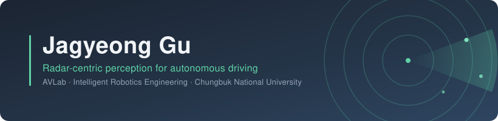

 

---

## 🔬 Research Interests

 

---

## 🚗 Projects

**[HL FMA 2026 (Future Mobility Award)](https://github.com/JaGyeong1024/2026-HL-FMA-VTD)** 2026.08.13 – 2026.09.12 · Simulation — Team lead, system architecture and Autoware integration: an Autoware stack driving in the VTD simulator over a custom ROS 2 `vtd_autoware_bridge`, with route injection, traffic-light handling, a control watchdog and mock regression tests. 
`Autoware` · `ROS 2` · `VTD`

**[SEA:ME Hackathon 2026](https://github.com/JaGyeong1024/SEA-ME-Hackathon-Clothoid-S)** 2026.07.14 – 2026.07.16 — Team lead, system architecture and perception for a camera-only scale car on a Telechips TOPST board: sign, lane and ArUco detectors in a single ROS 2 perception node with a control watchdog; YOLO26 also brought up on-board. Technology Award. 
`ROS 2 Humble` · `YOLO26` · `Telechips`

**[Multi-Rover Factory Control](https://github.com/JaGyeong1024/Multi-Rover-Localization-and-Factory-Control)** 2025.09 – 2026.06 — Capstone design, team lead: host-side localization and control for a leader–follower rover fleet, fusing UWB, ceiling-camera (YOLO11n-OBB) and IMU with an EKF, plus a real-time web control dashboard. 
`ROS 2 Humble` · `EKF` · `UWB · Camera · IMU`

**KSAE FSD 2025** 2025.09 – 2025.11 · Simulation — Perception: camera–LiDAR detection and fusion for the team's autonomous vehicle. 
`Camera–LiDAR Fusion`

**[Emergency Vehicle Warning System](https://github.com/JaGyeong1024/Satellite-Navigation-System-Project)** 2026.04 – 2026.05 — Course project (Satellite Navigation Systems), team lead: warns when an emergency vehicle is approaching in the same lane behind, from RTK / DGPS trajectories logged with a u-blox ZED-F9P and replayed on a map. 
`GNSS / RTK` · `u-blox ZED-F9P` · `Python`

**[Sensor Fusion Performance Comparison](https://github.com/JaGyeong1024/UROP-Sensor-Fusion-Performance-Comparison)** 2025.03 – 2025.06 — Independent UROP study comparing camera–LiDAR fusion strategies on an OC-SORT tracking pipeline, with ONNX export for deployment. 
`PyTorch` · `ONNX` · `KITTI` · `Camera–LiDAR`

---

## 🏆 Awards

| Year | Competition | Result | Role |
|---|---|---|---|
| 2026 | SEA:ME Hackathon | **Technology Award** | Team&nbsp;lead |
| 2025 | Autonomous Driving Racing Competition | **1st** — Grand Prize | Perception&nbsp;lead |
| 2025 | 4th International Student EV Autonomous Driving Competition | **2nd** — Jeju Nat'l Univ. President's Award | Perception&nbsp;lead |
| 2024 | AUTORACE | **1st** — Minister of Education Award | Member |
| 2024 | Autonomous Robot Race | **2nd** — Grand Prize | Member |

---

## 🛠 Stack

<table>
  <tr>
    <th align="right">Language</th>
    <td>
      
      
    </td>
  </tr>
  <tr>
    <th align="right">AI / ML</th>
    <td>
      
      
      
      
      
      
    </td>
  </tr>
  <tr>
    <th align="right">Robotics</th>
    <td>
      
      
      
    </td>
  </tr>
  <tr>
    <th align="right">Simulation</th>
    <td>
      
      
      
      <!--  -->
    </td>
  </tr>
  <tr>
    <th align="right">Sensors</th>
    <td>
      
      
      
      
    </td>
  </tr>
  <tr>
    <th align="right">Datasets</th>
    <td>
      
      
    </td>
  </tr>
  <tr>
    <th align="right">Edge Device</th>
    <td>
      
      
    </td>
  </tr>
  <tr>
    <th align="right">Infra / OS</th>
    <td>
      
      
      
      
    </td>
  </tr>
  <tr>
    <th align="right">Docs / Comm</th>
    <td>
      
      
      
    </td>
  </tr>
</table>

